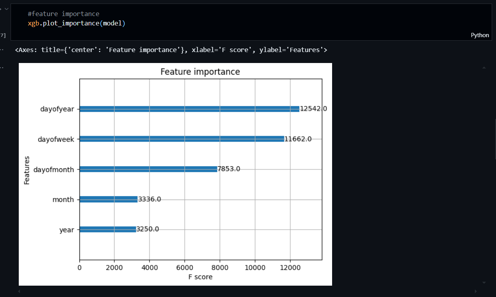
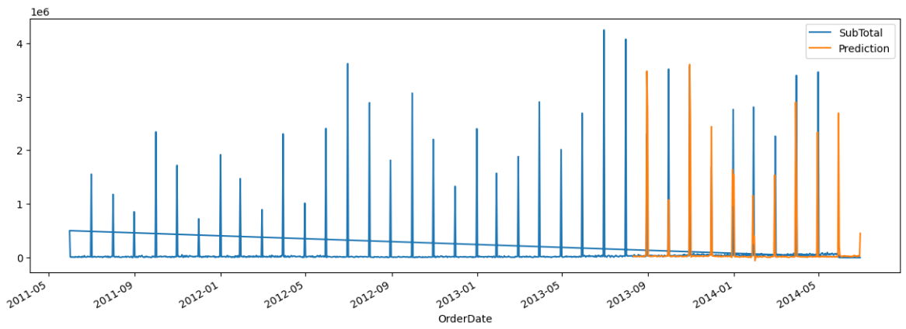
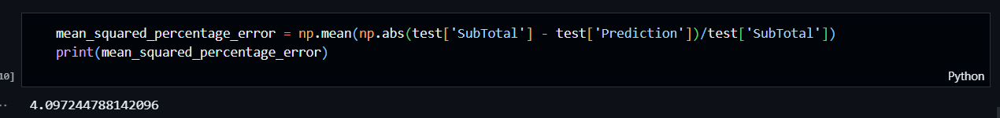

# Project Silent Talks

This project demonstrates time series forecasting using machine learning models like XGBoost and LightGBM. Built using Python and visualized with Matplotlib and Seaborn, it provides insights into trends and predictions using historical time series data.

## Features

- Forecasting using XGBoost and LightGBM
- Visualization of original and predicted time series
- Performance evaluation using MSE and other metrics
- Easily extensible for other datasets or models


## Tech Stack

- **Python**

- **Pandas** for data manipulation and preprocessing  
- **NumPy** for numerical computations  
- **Matplotlib** & **Seaborn** for data visualization  
- **Scikit-learn** for train-test splitting and evaluation  
- **XGBoost** and **LightGBM** for forecasting models

## Project Structure
```bash
Time-Series-Forecasting-Dashboard
├── Time_Series_Forecasting.ipynb # Jupyter Notebook for training and evaluating models
├── requirements.txt # Required Python libraries
└── README.md # Project overview and instructions

```
## Installation

1. Clone the repository and navigate to it on your machine

```bash
git clone https://github.com/Im-Arth1307/Time-Series-Forecasting-Dashboard.git
cd Time-Series-Forecasting-Dashboard
```

2. Install all the necessary dependencies

```
pip install -r requirements.txt
```

3. Open Time_Series_Forecasting.ipynb in Jupyter Notebook or Jupyter Lab and run the cells sequentially.
    
## Results

_Visualization of Feature Importance:_



_Predicted Sales versus Actual Sales Graph:_



_Mean Square Precentage Error for Evaluation:_

## Future Improvements 

- Add support for more time series datasets

- Hyperparameter tuning and feature engineering
## Contributing

Contributions are always welcome ! Feel free to fork the repo, make improvements and create a pull request.

## Contact
For any questions or suggestions, reach out to:

Atharva Jakhetiya 

Gmail: jakhetiyaathava@gmail.com

LinkedIn: https://www.linkedin.com/in/atharva-jakhetiya/

GitHub: https://github.com/Im-Arth1307